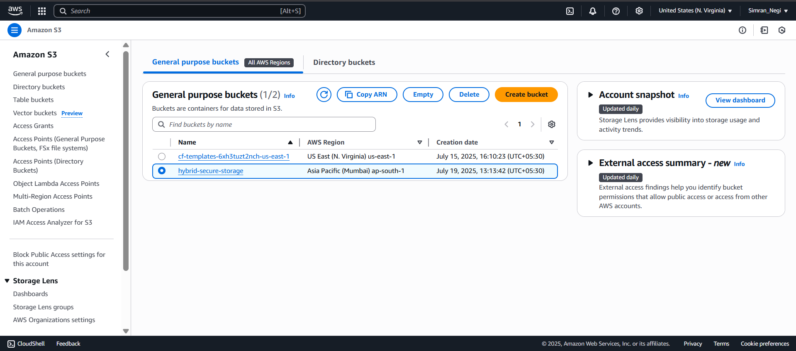

<h1 align="center">🔐 Secure Cloud Storage</h1>
<p align="center">
  A secure web application that allows users to upload, encrypt, and manage their files using a cloud storage backend (AWS S3). Built with Flask, SQLAlchemy, and integrated AWS services.<br>
  <em>Protect your files with encryption. Store and retrieve them with confidence.</em>
</p>

<p align="center">
  
  
  
  
</p>

---
Absolutely! Here's a polished `README.md` section that includes:

* A **Demo Video** (clickable image style as discussed)
* **Screenshots of AWS Buckets and their Objects**
* All content aligned and cleanly formatted

---

## 📽️ Demo

<p align="center">
  <a href="./demo/SecureCloudDemo.mp4">
    
  </a>
</p>

> 🔹 Click the play button above to watch the screen recording demo.

---

## 🛠️ Features

- 🔐 File encryption before upload
- ☁️ Secure storage on AWS S3
- 📥 Download & decrypt functionality
- 🧑‍💻 User authentication and dashboard
- 📊 Real-time progress and feedback
- 🌐 Deployed via cloud or local server

---

## 🌐 Technologies Used

| Layer         | Technology              |
|---------------|--------------------------|
| 👨‍💻 Frontend     | HTML5, CSS3, JavaScript      |
| ⚙️ Backend      | Python 3, Flask            |
| 🗃️ Database     | SQLite (via SQLAlchemy)     |
| 🔐 Encryption   | Fernet (Cryptography lib)   |
| 🎥 Demo Format | `.mp4` Screen Recording     |

---

## 🧳 AWS Integration

This project integrates directly with **AWS S3 Buckets** for file storage. Below are screenshots of the S3 buckets and the stored objects:

### 📁 S3 Bucket: `securecloud-user-files`

<p align="center">
  
</p>

### 📂 Encrypted Objects in Bucket

<p align="center">
  
</p>

> 🔒 Each file is encrypted client-side before being uploaded to the bucket.

---

## 🚀 Getting Started

1. Clone the repo:
    ```bash
    git clone https://github.com/yourusername/secure-cloud-storage.git
    cd secure-cloud-storage
    ```

2. Install dependencies:
    ```bash
    pip install -r requirements.txt
    ```

3. Add your AWS credentials and Flask secret key in a `.env` file:
    ```
    AWS_ACCESS_KEY_ID=your_key
    AWS_SECRET_ACCESS_KEY=your_secret
    AWS_BUCKET_NAME=your_bucket_name
    SECRET_KEY=your_flask_secret
    ```

4. Run the application:
    ```bash
    python app.py
    ```

---

## 📎 Folder Structure

secure-cloud-storage/
│
├── app.py
├── templates/
├── static/
├── demo/
│   └── SecureCloudDemo.mp4
├── screenshots/
│   ├── s3-bucket-list.png
│   └── s3-bucket-contents.png
└── requirements.txt


## 💡 Future Improvements

* 🗂️ Folder-wise uploads
* ⛅ Cloud Integration (Google Drive, AWS S3, etc.)
* 🔍 Search functionality
* 🔑 Two-Factor Authentication


<p align="center"><em>“Your data, your control.”</em></p>
```

